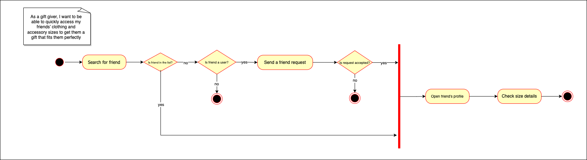
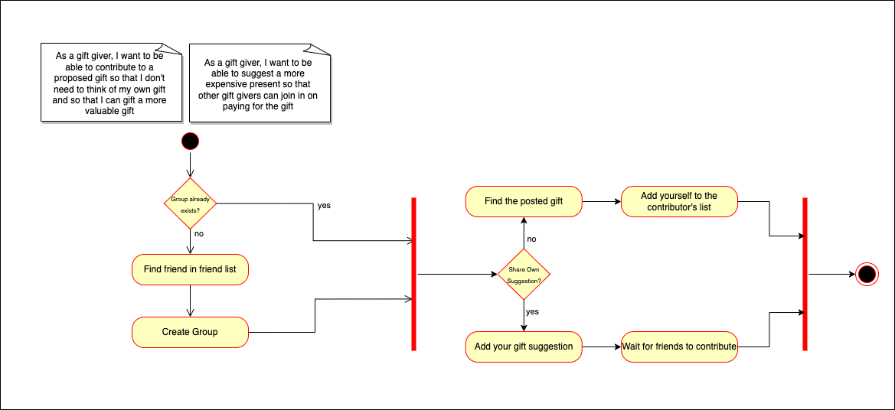
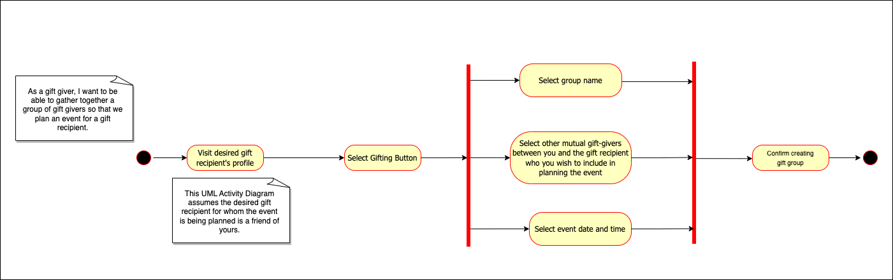
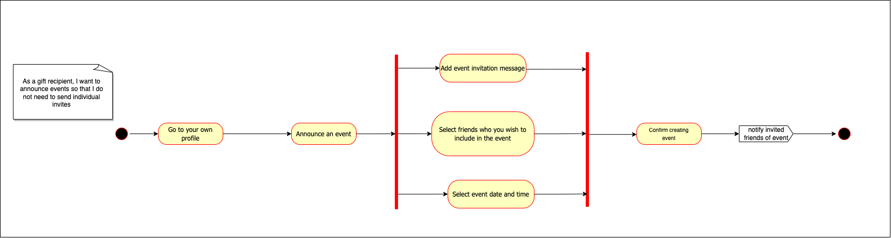

# Specification Phase Exercise

A little exercise to get started with the specification phase of the software development lifecycle. See the [instructions](instructions.md) for more detail.

## Team members

- [Dhiyaa Al Jorf](https://github.com/DoodyShark)

- [Firas Darwish](https://github.com/FirasBDarwish)

- [Shubhi Upadhyay](https://github.com/shubhiupa19)

## Stakeholders

### Jannah Mokhtar (An avid gift giver who enjoys the process of buying gifts):
- When buying my friend a gift ...
    - I'm not sure if they’d like this gift or not, their taste and preference.
    - figuring out their sizes and measurements **– esp the shoes, can’t get them shoes >:( –** is very difficult.
    - I like to be shown online links for easy and cheap purchase
    - I take extra credit in finding a gift that connects us (or bridges our interests)
- When I'm splitting a shared gift among my other friends ...
    - it poses a lot of issues with payment
    - people keep opting in and out, and the person who pays has to keep a manual tally of who's contributing and who paid already
    - I often find that one person bears the weight of buying the gift and then isn't paid back by everyone involved, so a way to guarantee the price can be split amongst more than one person would be helpful
        - There are restaurants in Abu Dhabi that allow you to split the bill across every one at the table so something like that would be great.
- I like to use Pinterest boards because it can ...
    - help find connections between friends.
    - help me get more inspiration
    - teach me about their vibes
    - they are very telling of a person
    - something like that can help inspire me to get gifts for someone because I get a feel for their personality/aesthetic
- I find it superficial and unnatural to get a person I don't quite know a gift of (for example) a character from a show/film they like if I didn't come to learn of that myself. I don't want to be 'told' what to get a person by a friend or otherwise; it is nicer to make that discovery and feel like you're learning about a person.
- It is important to be able to find the easiest, fastest, cheapest places to get the gifts as it would save me time looking for where I can find something I saw online.
- On WeChat, there is a feature where you can scan items, clothing, accessories, etc. you find daily and be given links to where you can buy something that matches to that item.

### Baraa Al Jorf (A more practical gift giver who sees the gift as the end goal of gift giving):
- I keep receiving generic gifts I hate and which I'd rather get the monetary value of instead.
- When I'm buying my friend a gift ...
    - I don't like spending the time thinking about what to get them. 
    - some people are impossible to buy gifts for. Would be nice if I have some sort of list of interests.
    - Even better if there's a tool to recommend what I should buy given those interests.
    - there's a feature on Etsy that does a similar thing but you have to manually input the gift recipient's interests
    - I always procrastinate or forget, so I often end up in a race against time. Would be nice if I'm notified in advance.
    - It's awkward to ask about their size. It's not always easy to find indirect means of getting that information.
    - I sometimes have to give them the receipt (which is awkward now that I have to show them the price) so that they have the option to return/exchange the gift
    - Friends sometimes end up buying similar/repeated gifts. Would be nice to know what others are gifting.
- When I'm splitting a shared gift among my other friends ...
    - I usually coordinate between many applications.
    - it's always a pain to pay the person who bought the gift back (I never have change on me). I also have to go out of my way and meet the person physically.
    - Other times when I'm paying I'm actually paying on behalf of other people as well who already sent me money which makes it more difficult to keep track of who owes whom.
    - people take forever to confirm whether they're contributing or not, and keeping track of who confirmed their contribution is cumbersome.
- DISCOUNTS! I love saving money so I would like if the tool finds me the cheapest options.

### Problems/Frustrations
1. Choosing valuable gifts that the recipient will actually appreciate is difficult and often results in generic gifts
1. Even when *the perfect gift* is found, it often involves picking sizes, measurements, colors, etc. that could make or break the gift.
1. Shared gifts involve
    - coordination between many different platforms which can be painful
    - keeping manual tallies of constantly changing variables (e.g. who's contributing, who paid already, etc)
    - the payment process is painful and often involves mutliple people paying through the same proxy person
1. The perfect gift can sometimes cost too much

### Goals/Needs
1. Some way for gift recipients to list their interests (even if intangible interests) would be invaluable for the gift givers in picking a valuable non-generic gift
1. Some place for all the gift recipients sizes and measurements to be accessible for gift givers to refer to when making a purchase
1. A gift recommendation tool that both ...
    - suggests gifts based on the friends interests
    - finds discounts and cheaper alternatives to proposed gifts
1. A gift coordination tool would be perfect to solve all the gift splitting coordination shinanigans.

## Product Vision Statement

Treasure Trove aims to revolutionize gift-giving into an enjoyable, collaborative journey of personalized discovery.

## User Requirements

1. “As a gift recipient, I want to display my clothing and shoe sizes so that my friends can buy me gifts that fit me"

1. “As a gift recipient, I want to announce events so that I don't need to send individual invites"

1. “As a gift recipient, I want to create an interest board where I can pin media that interest me so that gift givers can buy me something I actually like”

1. “As a gift giver, I want direct links to where I can buy items I view so I that I can save time and energy searching for where to buy a gift”

1. “As a gift giver, I want to receive notifications ahead of my friends’ birthdays so that I do not forget to get them a gift”

1. “As a gift giver, I want to know what other gift givers are giving a friend so that I do not gift the same present”

1. “As a gift giver, I want to be able to browse a curated interest board so that I can brainstorm a personalized gift idea quickly”

1. “As a gift giver, I want to be able to gather together a group of gift givers so that we plan a surprise event for a gift recipient"

1. “As a gift giver, I want to be able to suggest a more expensive present so that other gift givers can join in on paying for the gift”

1. “As a gift giver, I want to be able to contribute to a proposed gift so that I don't need to think of my own gift and so that I can gift a more valuable gift"

1. “As a group of gift givers, we want to be able to split the bill on shared gifts so that there isn’t a financial burden placed on a single gift giver”

1. “As a gift giver, I want to be able to quickly access my friends’ clothing and accessory sizes to get them a gift that fits them perfectly”

1. “As a gift giver, I want to view shared interests and media between me and a gift recipient so that we can bond over meaningful presents that reflect what we both love”

## Activity Diagrams

## Wireframe

[Link to wireframe](https://www.figma.com/file/7TXfUed5dSXl66ay38D9sf/Project-1-Prototype?type=design&node-id=58%3A1072&mode=design&t=8CUCXajHT4bHui7x-1)

## Clickable Prototype

[Link to prototype](https://www.figma.com/proto/7TXfUed5dSXl66ay38D9sf/Project-1-Prototype?type=design&node-id=10-819&t=vOK0tOavvG5I2vVY-1&scaling=scale-down&page-id=0%3A1&starting-point-node-id=10%3A819&mode=design)